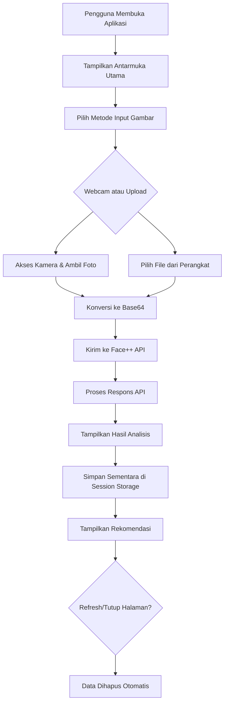

# Rancangan Sistem Analisis Kesehatan Kulit Sementara

  STACK
  * Next.js 15 (with App Router)
  * TypeScript (recommended for better development experience)
  * Tailwind CSS for styling
  * shadcn/ui for pre-built components
  * API Routes (Next.js) for server-side API calls to Face++ (to keep API keys secret)
  * React Hooks for state management (useState, useEffect, etc.)
  * sessionStorage for temporary storage (optional, if we want to persist during the session, but note: requirement says after refresh it resets, so we might not even need sessionStorage. However, we can use it to avoid re-uploading if the user refreshes accidentally, but the requirement says it should reset. So we can skip storage if strictly required.)
## 📋 Gambaran Umum

Sistem analisis kesehatan kulit berbasis web yang bersifat sementara, tanpa penyimpanan data permanen, tanpa autentikasi pengguna, dan semua hasil analisis akan hilang setelah halaman direfresh atau ditutup.

## 🎯 Tujuan

Menyediakan alat analisis kesehatan kulit instan tanpa komitmen penyimpanan data pribadi pengguna, cocok untuk penggunaan sekali pakai atau demonstrasi.

## 🏗️ Arsitektur Sistem

```
┌─────────────────┐    ┌──────────────────┐    ┌────────────────┐
│   Frontend Web  │    │   Browser Storage│    │   Face++ API   │
│   (HTML/CSS/JS) │◄──►│   (Session)      │◄──►│   Services     │
│                 │    │                  │    │                │
└─────────────────┘    └──────────────────┘    └────────────────┘
```

## ✨ Fitur Utama

1. **Analisis Wajah Real-time**

   - Deteksi wajah melalui webcam
   - Upload gambar dari perangkat
   - Preview gambar sebelum analisis
2. **Analisis Kulit Instan**

   - Skor kesehatan kulit keseluruhan
   - Deteksi masalah spesifik (jerawat, noda, kerutan)
   - Visualisasi hasil interaktif
3. **Analisis Tambahan**

   - Deteksi usia dan jenis kelamin
   - Analisis ekspresi wajah
   - Skor kecantikan
4. **Rekomendasi Sementara**

   - Saran perawatan dasar
   - Tips perbaikan kondisi kulit
   - Informasi edukasional
5. **Pengalaman Tanpa Komitmen**

   - Tidak perlu registrasi
   - Tidak ada penyimpanan data
   - Hasil hanya tersedia selama sesi browser aktif

## 🔧 Komponen Teknis

### 1. Modul Input Gambar

- **Webcam Capture**: Akses kamera melalui browser API
- **File Upload**: Unggah gambar dari perangkat
- **Image Validation**: Validasi format dan kualitas gambar

### 2. Modul Pemrosesan

- **Face++ API Integration**: Komunikasi dengan layanan analisis wajah
- **Data Processing**: Transformasi respons API ke format yang dapat ditampilkan
- **Session Management**: Penyimpanan sementara di sessionStorage

### 3. Modul Tampilan

- **Result Visualization**: Menampilkan hasil analisis dengan chart dan diagram
- **Recommendation Engine**: Menghasilkan saran berdasarkan hasil analisis
- **Responsive Design**: Tampilan yang optimal di berbagai perangkat

## 📊 Flow Penggunaan



## 🎨 Rancangan Antarmuka

### Halaman Utama

- **Header**: Judul aplikasi dan penjelasan singkat
- **Selection Area**: Pilihan antara webcam dan upload gambar
- **Instructions**: Panduan penggunaan sederhana

### Area Webcam

- **Live Preview**: Tampilan video langsung dari kamera
- **Capture Button**: Tombol untuk mengambil gambar
- **Retry Option**: Opsi untuk mengambil ulang gambar

### Area Upload

- **File Picker**: Input untuk memilih file gambar
- **Preview Area**: Tampilan preview gambar yang dipilih
- **Validation Messages**: Pemberitahuan format file yang didukung

### Halaman Hasil

- **Overall Score**: Skor kesehatan kulit keseluruhan
- **Attribute Breakdown**: Detail analisis per aspek kulit
- **Demographic Info**: Usia, jenis kelamin, ekspresi
- **Beauty Score**: Skor kecantikan relatif
- **Visual Charts**: Grafik radar atau bar chart untuk visualisasi
- **Recommendations**: Daftar saran perawatan
- **New Analysis Button**: Opsi untuk analisis baru

## 🔌 Integrasi API Face++

### Parameter Request

```javascript
{
  api_key: "KUNCI_API_ANDA",
  api_secret: "RAHASIA_API_ANDA",
  image_base64: "DATA_GAMBAR_BASE64",
  return_landmark: 2, // 106-point landmarks
  return_attributes: "skinstatus,gender,age,emotion,beauty,headpose,facequality,blur,eyestatus,mouthstatus"
}
```

### Response Processing

- Ekstraksi data skinstatus dari respons API
- Normalisasi nilai ke skala 0-100
- Interpretasi nilai untuk rekomendasi
- Analisis ekspresi dan demografi pengguna
- Penilaian kualitas gambar

## 💾 Penyimpanan Sementara

### Session Storage

- Menyimpan hasil analisis terakhir
- Data bertahan selama sesi browser tetap aktif
- Data terhapus otomatis saat tab/ browser ditutup

### Struktur Data

```javascript
{
  timestamp: "2023-11-30T12:34:56Z",
  imageData: "base64_thumbnail",
  analysisResults: {
    skin: {
      health: 85,
      acne: 15,
      stain: 22,
      dark_circle: 30,
      wrinkle: 10
    },
    demographics: {
      age: 25,
      gender: "Female"
    },
    emotion: {
      happiness: 85.2,
      neutral: 10.3,
      // ... other emotions
    },
    beauty: {
      male_score: 78.5,
      female_score: 82.3
    }
  },
  recommendations: [
    "Gunakan pelembap dengan SPF",
    "Pertimbangkan serum vitamin C"
  ]
}
```

## ⚙️ Konfigurasi

### Environment Variables

```javascript
// Konfigurasi aplikasi
const CONFIG = {
  FACE_API_KEY: import.meta.env.VITE_FACE_API_KEY,
  FACE_API_SECRET: import.meta.env.VITE_FACE_API_SECRET,
  API_ENDPOINT: "https://api-us.faceplusplus.com/facepp/v3/detect",
  MAX_FILE_SIZE: 2 * 1024 * 1024, // 2MB sesuai batasan API
  SUPPORTED_FORMATS: ["image/jpeg", "image/png"]
};
```

## 🛡️ Pertimbangan Keamanan dan Privasi

### Perlindungan Data

- Tidak ada penyimpanan data permanen
- Gambar tidak dikirim ke server selain Face++ API
- Session storage dibersihkan otomatis

### Persetujuan Pengguna

- Notifikasi penggunaan kamera
- Peringatan tentang sifat sementara hasil analisis
- Informasi tentang pemrosesan data oleh pihak ketiga (Face++)

## 📱 Responsivitas

### Breakpoint Design

- **Mobile**: < 768px (optimalkan untuk touch interaction)
- **Tablet**: 768px - 1024px (tampilan balanced)
- **Desktop**: > 1024px (tampilan lengkap dengan sidebar)

## 🎯 Indikator Kinerja

### Metrik Utama

- Waktu pemrosesan rata-rata < 10 detik
- Akurasi interpretasi hasil berdasarkan testing manual
- Kepuasan pengguna dengan antarmuka yang sederhana

### Pengalaman Pengguna

- Feedback visual selama pemrosesan
- Pesan error yang jelas dan membantu
- Panduan langkah demi langkah

## 🔄 Opsi Pengembangan Masa Depan

### Potensi Peningkatan

1. **Export Results**: Opsi mengunduh hasil sebagai PDF
2. **Comparison Tool**: Bandingkan beberapa analisis dalam sesi yang sama
3. **Product Recommendations**: Tautan ke produk perawatan kulit
4. **Multi-language Support**: Dukungan bahasa tambahan
5. **3D Face Reconstruction**: Visualisasi wajah 3D
6. **Face Shape Analysis**: Analisis bentuk wajah berdasarkan landmark
7. **Timeline Tracking**: Tracking perubahan kondisi kulit dari waktu ke waktu

Rancangan ini memenuhi kebutuhan sistem analisis kesehatan kulit sementara yang mudah digunakan, menghormati privasi pengguna, dan memberikan nilai instan tanpa komitmen penyimpanan data jangka panjang.
